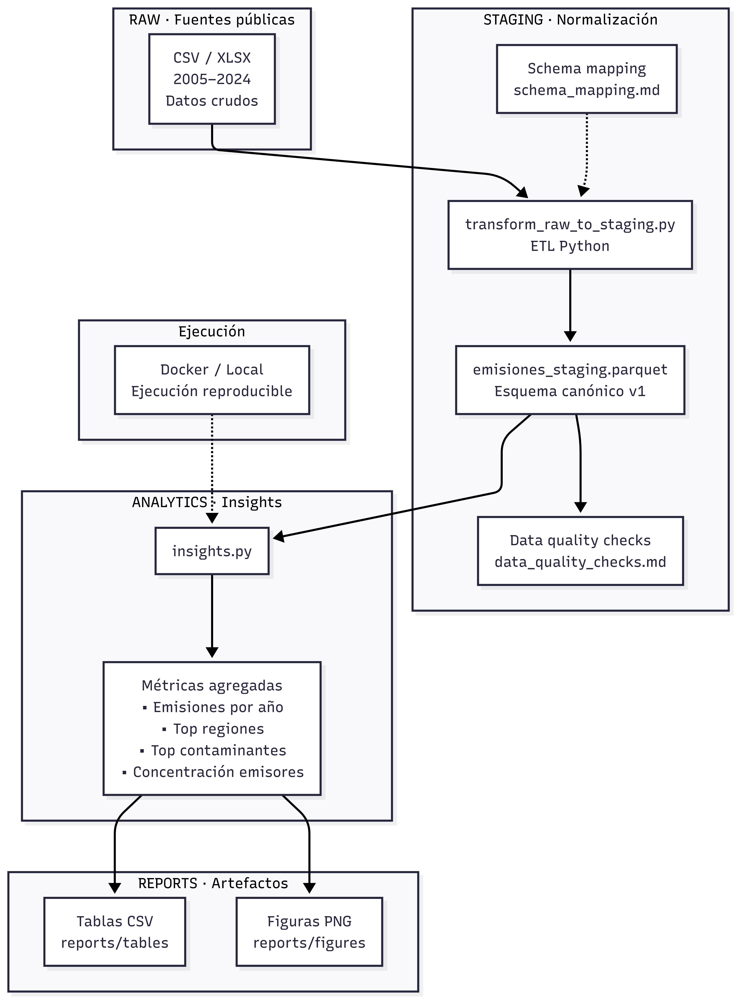

# Environmental Data Platform - End-to-End Emissions Analytics

#### Autor : Eduardo S. Henríquez N.
#### Fecha : 21 / 01 / 26.

## Descripción General

Plataforma de datos orientada a la ingesta, estandarización, modelado y análisis analítico
de emisiones a cuerpos de agua en Chile, construida a partir de datos públicos oficiales
de la Subsecretaría del Medio Ambiente.

El proyecto implementa un *pipeline end-to-end* reproducible, desde fuentes históricas
heterogéneas hasta la generación de *insights* analíticos y artefactos de reporte,
siguiendo buenas prácticas de ingeniería de datos.

## Objetivos del Proyecto

- Consolidar múltiples fuentes históricas (2005–2024) con esquemas heterogéneos en un modelo canónico único.
- Implementar una capa *staging* limpia, tipada y documentada.
- Incorporar criterios explícitos de calidad y trazabilidad de datos.
- Generar *insights* analíticos reproducibles mediante scripts Python.
- Proveer artefactos listos para consumo: tablas analíticas y visualizaciones.

------------
## Arquitectura del *Pipeline*

El pipeline sigue una arquitectura por capas:  **RAW → STAGING → ANALYTICS → REPORTS**

<p align="center">
  
</p>
*El diagrama ilustra el flujo end-to-end del pipeline, incluyendo normalización,
validaciones de calidad, ejecución reproducible y generación de artefactos analíticos.*

<br><br><br>

-----------
## Estructura del Proyecto

```text
emissions-data-platform-e2e/
├── data
│   ├── raw/                     # Datos originales (fuentes públicas)
│   │   ├── 2005-2017.csv
│   │   ├── 2018.csv
│   │   ├── 2019.csv
│   │   ├── 2020.csv
│   │   ├── 2021.csv
│   │   ├── 2022.csv
│   │   ├── 2023.csv
│   │   └── 2024-2026.csv
│   └── staging/
│       └── emisiones_staging.parquet
│
├── src
│   ├── staging/                 # Transformaciones RAW → STAGING
│   │   └── transform_raw_to_staging.py
│   └── analytics/               # Capa analítica e insights
│       └── insights.py
│
├── reports
│   ├── figures/                 # Visualizaciones generadas
│   │   ├── emisiones_por_anio.png
│   │   ├── top_contaminantes.png
│   │   └── top_regiones.png
│   └── tables/                  # Tablas analíticas
│       ├── concentracion_top_emisores.csv
│       ├── emisiones_por_anio.csv
│       ├── top_contaminantes.csv
│       └── top_regiones.csv
│
├── docs
│   ├── schema_mapping.md        # Definición del esquema canónico
│   └── data_quality_checks.md   # Validaciones de calidad de datos
│
├── Dockerfile                   # Ejecución reproducible del pipeline
├── requirements.txt             # Dependencias del proyecto
└── README.md
```
-----------

## Notas sobre la estructura

- La organización del proyecto separa claramente:

- Datos originales (**RAW**),

- Datos consolidados y normalizados (**STAGING**),

- Lógica de transformación y análisis (**src**),

- Artefactos finales listos para consumo (**reports**).

-------------

## Dataset

- Fuente: **Subsecretaría del Medio Ambiente (República de Chile)**

- Cobertura temporal: **2005 - 2024**

- Registros: **~179.000**

- Dominio: **Emisiones industriales a cuerpos de agua**

- Formato *staging* : **Parquet (esquema canónico v1)**

**Nota:**
El archivo administrativo `2024–2026.csv` contiene registros reportados únicamente para el año 2024.
No existen datos efectivos para los años 2025 ni 2026 en el campo anio.

---------

## Key Insights (Resumen Analítico)

A partir del análisis del dataset consolidado en la capa STAGING:

- Cobertura temporal: **2005–2024. **

- Región con mayor emisión acumulada: **Antofagasta.**

- Contaminante predominante: **Cloruros.**

- Alta concentración de emisores:
    - **El 5% de los establecimientos concentra aproximadamente el 92,8% del total de emisiones, evidenciando un fuerte efecto Pareto.**

Los resultados completos se encuentran versionados en:

- **reports/figures/**

- **reports/tables/**

-------

## Ejecución del Proyecto

### Ejecución con Docker

```bash
docker build -t emissions-e2e:latest .
docker run --rm \
  -v "$(pwd)/data:/app/data" \
  -v "$(pwd)/reports:/app/reports" \
  emissions-e2e:latest
```

### Ejecución local

```bash
python -m venv venv
source venv/bin/activate
pip install -r requirements.txt
python -m src.analytics.insights
```

## Sample Output (Ejecución exitosa)

La ejecución del pipeline analítico —tanto en modo Docker como en ejecución local—
produce el siguiente resumen en consola, validando la correcta carga del dataset
STAGING, la generación de artefactos analíticos y la obtención de insights reproducibles:

```text
=== Analytics: Insights (STAGING) ===
Input: data/staging/emisiones_staging.parquet
Shape: (178963, 27)

=== Outputs ===
- Figures: reports/figures
- Tables : reports/tables

=== Summary ===
- Años cubiertos: 2005–2024
- Región #1 (acumulado): Antofagasta
- Contaminante #1 (acumulado): Cloruros
- Concentración top 5% emisores: 92.83%

```

## Uso de Docker y Reproducibilidad

Docker se incorpora en este proyecto con el objetivo de garantizar reproducibilidad
completa del entorno de ejecución, independientemente del sistema operativo o configuración local del usuario.

En particular se busca:

- Ejecutar el pipeline analítico sin depender de entornos virtuales locales.
- Asegurar versiones consistentes de dependencias críticas (pandas, pyarrow, matplotlib).
- Simplificar la ejecución del proyecto para terceros (evaluadores, reclutadores, personas que quieran revisarlo).
- separar claramente código y entorno de datos y resultados.

La ejecución con Docker está pensada como el modo recomendado para consumo y revisión expedita, mientras que la ejecución local queda orientada a desarrollo, exploración y extensión del código.

------

## Tecnologías Utilizadas

- Lenguaje: **Python 3**

- Procesamiento de datos: **Pandas**

- Formato columnar: **Parquet (pyarrow)**

- Visualización: **matplotlib**

- Contenerización: **Docker**

- Control de versiones: **Git / GitHub**

------------

## Conclusión

Este proyecto demuestra la construcción de un pipeline de datos end-to-end reproducible,
capaz de transformar fuentes públicas heterogéneas en un modelo analítico consistente y
resultados accionables.

La solución prioriza buenas prácticas de ingeniería de datos, separación clara de capas
(RAW, STAGING, ANALYTICS) y generación de insights relevantes para análisis ambiental,
fiscalización y toma de decisiones.

